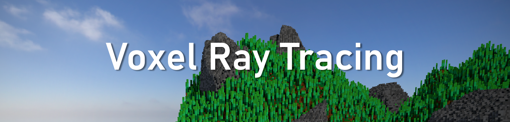

# Voxel Ray Tracing

Theis project is a real-time voxel ray tracer, using the Vulkan API.
It was developed as a senior project at Kansas State University, advised by Dr. Hsu.

## Documentation

See the docs folder for some documentation on how the project works.
`docs/presentations` contains the slides from each of the presentations.

## Building and Running

Before building, you'll need to install the following prerequisites:
- Visual Studio 2019
  - Desktop Development with C++ Workload
- CMake
- [Vulkan SDK](https://www.lunarg.com/vulkan-sdk/)
- Python
- Conan `pip install conan`

This project uses CMake as a build system.
The easiest way to run it would be to open the project in a C/C++ IDE which supports CMake.
I've ran using [CLion](https://www.jetbrains.com/clion/) for most of my work.
It's also possible to use CMake on the command line, though I'm less familiar with the syntax there.

Once you have the project opened, the `voxels_run` target can be built to generate the executable.
Just run that to run the project!

## Compatability

The current build of the project can only run on Windows.
However, the only Windows-only dependency is [AMD's FSR 2.0](https://github.com/GPUOpen-Effects/FidelityFX-FSR2),
which could be removed if you need to build on Mac or Linux.

I've also only tested on Nvidia GPUs - there's always a chance I'm relying on some driver behavior I shouldn't for AMD.

## Dependencies

Most dependencies are managed using [Conan](https://conan.io/).
The project CMake script will download and install them for you.
Others are included in the `thirdparty` directory.

The complete list of dependencies:
- [Vulkan](https://www.vulkan.org/)
- [Vulkan-Hpp](https://github.com/KhronosGroup/Vulkan-Hpp)
- [VkBootstrap](https://github.com/charles-lunarg/vk-bootstrap)
- [Vulkan Memory Allocator](https://gpuopen.com/vulkan-memory-allocator/)
- [glfw](https://www.glfw.org/)
- [glm](https://github.com/g-truc/glm)
- [stb](https://github.com/nothings/stb)
- [opengametools](https://github.com/jpaver/opengametools)
- [Dear ImGui](https://github.com/ocornut/imgui)
- [FidelityFX Super Resolution 2](https://github.com/GPUOpen-Effects/FidelityFX-FSR2)
- [Native File Dialog](https://github.com/mlabbe/nativefiledialog)
- [fmt](https://fmt.dev/latest/index.html)
- [bitflags](https://github.com/m-peko/bitflags)
- [Catch2](https://github.com/catchorg/Catch2)
